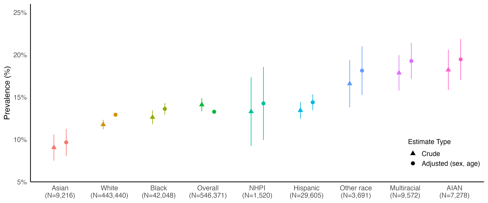

# Prevalence of Subjective Cognitive Decline (SCD), 2019-2023

## Introduction

This repository contains code for estimating the prevalence of Subjective Cognitive Decline (SCD) using BRFSS data from 2019-2023. The analysis incorporates survey weighting, multiple imputation for missing data, stratification by race/ethnicity, and adjustment for sex and 5-year age groups using predictive marginal standardization.
Below is a visualization of the estimated prevalence of Subjective Cognitive Decline (SCD) by race/ethnicity:



### **Data Availability**

Zipped folders containing SAS-format `.XPT` files for this analysis are available from the **CDC BRFSS website**. A summary of jurisdictions administering the SCD module in each year is available in `SCD-modules.csv`. To download the necessary BRFSS datasets, please refer to [`data_links.txt`](data_links.txt), which contains a full list of download links from the CDC.

### **Setup Instructions**

1. **Download this repository**
```sh
git clone https://github.com/lamhine/brfss_scd.git
cd brfss_scd
```
Or download the ZIP manually from GitHub and extract it to a local folder.

2. **Download BRFSS data** from the CDC using the links in [`data_links.txt`](data_links.txt).
   - Place the `.zip` files inside the `raw_data/` folder inside this repository.

3. **Open the RStudio Project (`brfss_scd.Rproj`)**.

4. **Run the project setup script:**
```r
source("setup.R") # Ensures directories are set up
```

5. **Run the analysis pipeline in R:**
```r
source("01_load_data.R")    # Loads raw BRFSS data and extracts XPT files
source("02_clean_data.R")   # Cleans and preprocesses data
source("03_multiple_imputation.R")  # Handles missing data
source("04_analyze_data.R") # Runs analysis and estimates prevalence
source("05_visualize_results.R") # Generates tables and plot
```

### **Outputs**
R data files, housed in `processed_data_dir/01_data`
- `01_filtered_data.rds` → Raw data filtered for state-years with SCD module (`01_load_data.R`)
- `02_cleaned_data.rds` → Cleaned dataset (`02_clean_data.R`)
- `03A_imputed_data.rds` → Imputed dataset with diagnostics (`03_multiple_imputation.R`)
- `03B_completed_imputations.rds` → Completed imputation list (`03_multiple_imputation.R`)
- `04A_survey_designs.rds` → Survey designs for tables (`04_analyze_data.R`)
- `04B_summary_results.rds` → Summarized data ready for plotting (`04_analyze_data.R`)

Tables & figures, housed in `processed_data_dir/03_results`
- `table_1A.rds` → Table 1, summarizing imputed data (`05_visualize_results.R`)
- `table_1B.rds` → Table 1, summarizing complete case data (`05_visualize_results.R`)
- `table_2.rds` → Table 2, summarizing adjusted results (`05_visualize_results.R`)
- `figure_1.png` → Final plot of adjusted prevalence (`05_visualize_results.R`)

### **Troubleshooting**
- **Missing BRFSS files?** Ensure `.zip` files are inside `raw_data/`, and `.XPT` files are extracted into `raw_data/unzipped/` by `01_load_data.R`.
- **`config.R` errors?** Ensure `raw_data_dir` and `processed_data_dir` are correctly set in `config.R`.
- **Working directory errors?** Always open the `.Rproj` file before running scripts.

For questions, open an issue on GitHub.
